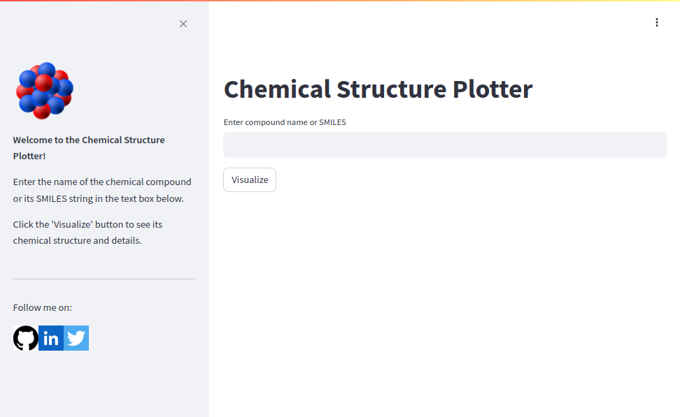

# Chemical Structure Plotter

[](https://chemstructureplotter.onrender.com/)

Chemical Structure Plotter is a Streamlit web application that enables users to visualize the chemical structure of compounds based on their names or SMILES strings. It utilizes PubChemPy to fetch compound details from PubChem and RDKit to generate and display the chemical structures.

[](https://chemstructureplotter.onrender.com/)


## Table of Contents

- [Installation](#installation)
- [Usage](#usage)
- [Features](#features)
- [Demo](#demo)
- [Contributing](#contributing)
- [Credits](#credits)
- [License](#license)

## Installation

1. Clone the repository:

    ```bash
    git clone https://github.com/your-username/chemical-structure-plotter.git
    cd chemical-structure-plotter
    ```

2. Install the dependencies:

    ```bash
    pip install -r requirements.txt
    ```

## Usage

1. Run the Streamlit app:

    ```bash
    streamlit run app.py
    ```

2. Open the web browser and navigate to [http://localhost:8501](http://localhost:8501).

3. Enter the name of the chemical compound or its SMILES string in the text box.

4. Click the "Visualize" button to see the chemical structure and details.

## Features

- Input validation for compound names and SMILES strings.
- Error handling for invalid input and failed API requests.
- Interactive visualization with compound details displayed alongside the chemical structure.
- Responsive design suitable for various screen sizes.

## Demo

[Watch a demo](https://youtu.be/your-demo-video) to see Chemical Structure Plotter in action.

## Contributing

We welcome contributions from the community to improve Chemical Structure Plotter! If you're interested in contributing, please feel free to reach out to us directly or open an issue to discuss your ideas.

Your contributions can include bug fixes, feature enhancements, documentation improvements, or any other enhancements that you think would benefit the project. We appreciate your support and look forward to your contributions!

## Credits

- [Streamlit](https://streamlit.io/)
- [PubChemPy](https://pubchempy.readthedocs.io/)
- [RDKit](https://www.rdkit.org/)

